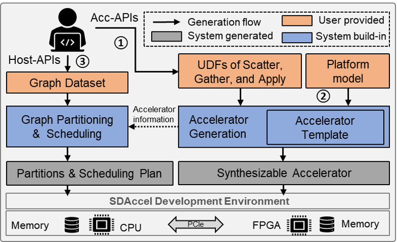

[](./LICENSE)
[](https://github.com/Xtra-Computing/ThunderGP/issues)
[](https://zenodo.org/badge/latestdoi/254307005)

# ThunderGP: HLS-based Graph Processing Framework on FPGAs

## What's new?

ThunderGP has been published in ACM Transactions on Reconfigurable Technology and Systems (TRETS), as one of "Best Papers in FPGA 2021". 

ThunderGP won the third place in [2020 Xilinx Adaptive Computing Developer Contest](https://www.hackster.io/contests/xilinxadaptivecomputing), top 9 out of 79 teams.

ThunderGP is accepted to be [FPGA 2021](https://isfpga.org/). Read [the paper](https://github.com/Xtra-Computing/ThunderGP/blob/master/ThunderGP_camera_ready-pdfa.pdf).

ThunderGP is featured at [Xilinx Apps and Libraries](https://www.xilinx.com/products/apps-and-libraries.html).

ThunderGP was presented at [XACC@NUS Workshop Series 2020: Reconfigurable Computing Systems](https://xaccnus.github.io/). see [Slides](https://xaccnus.github.io/slides/ThunderGP_Fast_Graph_Processing_for_HLS-based_FPGAs.pdf), [Video/Youtube](https://youtu.be/zqxLevJiCpk), [Video/bilibili](https://www.bilibili.com/video/BV1kD4y1m7r8/).


## Introduction

ThunderGP enables data scientists to enjoy the ***performance*** of FPGA-based graph processing without compromising ***programmability***. ***To our best knowledge and experiments, this is the fastest graph processing framework on HLS-based FPGAs.***

Two aspacts make the ThunderGP deliver superior performance.
On the one hand, ThunderGP embraces an improved execution flow to better exploit the pipeline parallelism of FPGA and alleviate the data access amount to the global memory. On the other hand, the memory accesses are highly optimized to fully utilize the memory bandwidth capacity of the hardware platforms. 

On Xilinx multi-SLR based FPGAs, it is running at 250Mhz, and the performance can be up to ***6400 MTEPS (million traversed edges per second)***, or a ***2.9 times speedup*** over the state-of-the-art.  

***For HBM-based version, please check the branch "develop_u50".***


## Prerequisites
* The gcc-9.3
* Tools:
    * SDAccel 2018.3 Design Suit
    * SDAccel 2019.1 Design Suit
* Evaluated platforms from Xilinx:
    * Xilinx Virtex UltraScale+ FPGA VCU1525 Acceleration Development Kit (SDAccel 2018.3)
    * Alveo U200 Data Center Accelerator Card (SDAccel 2019.1)
    * Alveo U250 Data Center Accelerator Card (SDAccel 2019.1)
    
## Run the code
ThunderGP currently has seven build-in graph algorithms: PageRank (PR), Sparse Matrix-Vector Multiplication (SpMV), Breadth-First Search (BFS), Single Source Shortest Path (SSSP), Closeness Centrality (CC), ArticleRank (AR), and Weakly Connected Component (WCC). 
The desired application can be implemented by passing argument ```app=[the algorithm]``` to ``` make ``` command. The below table is for quick reference.

| Argument    | Accelerated algorithm  |
|--------------|--------------|
| ```app=pr``` | PageRank (PR)|
| ```app=spmv``` | Sparse Matrix-vector Multiplication (SpMV) |
| ```app=bfs``` | Breadth First Search (BFS)|
| ```app=sssp``` | Single Source Shortest Path (SSSP)|
| ```app=cc``` | Closeness Centrality (CC)|
| ```app=ar``` | ArticleRank  (AR)|
| ```app=wcc``` | Weakly Connected Component  (WCC)|

#### Here is the example of implementing the accelerator for PageRank on Alveo U250 platform with SDAccel 2019.1. 
```sh
$ git clone https://github.com/Xtra-Computing/ThunderGP.git
$ cd ./
$ vim ThunderGP.mk 
$ # configure the DEVICE as DEVICES := xilinx_u250_xdma_201830_2; configure TARGETS := hw
$ make app=pr all # make the host execution program and the FPGA bitstream. It takes time :)
# For execution on real hardware. The path of graph dataset needs to be provided by the user. 
$ ./host_graph_fpga_pr xclbin_pr/*.xclbin ./dataset/rmat-14-32.txt
```
#### More details: [Compiling ThunderGP ](docs/compile_arch.md)

## Results (performance)

Throughput (MTEPS) of different graph processing algorithms over datasets on VCU1525 platform.

|App.|PR|SPMV|BFS|SSSP|CC|AR|WCC |
|----|--|----|---|----|--|--|----|
|R21| 5,015|4,190|5,417|3,901|4,623|4,848|4,584 |
|R24| 4,599|3,781|3,437|3,430|4,339|4,486|4,328 |
|G24| 5,039|4,037|5,216|3,725|4,752|4,927|4,704 |
|G25| 4,464|3,615|4,660|3,343|4,344|4,389|4,356 |
|WT|  2,884|2,874|2,717|2,427|2,776|2,833|2,776 |
|MG|  4,454|3,883|4,939|3,699|4,077|4,285|4,088 |
|PK|  4,001|3,729|4,251|3,169|3,833|3,909|3,716 |
|WP|  3,030|2,994|3,112|2,491|2,993|2,931|2,894 |
|LJ|  3,186|3,003|3,408|2,623|3,113|3,081|3,099 |
|TW|  2,938|2,801|2,120|2,425|2,962|2,853|2,894 |


Throughput (MTEPS) of different graph processing algorithms over datasets on U250 platform. 


|App.|PR|SPMV|BFS|SSSP|CC|AR|WCC |
|----|--|----|---|----|--|--|----|
|R21  |4,669|5,056|6,028|4,879|4,783|4,667|4,901 |
|R24  |4,732|4,946|5,897|4,285|4,939|4,732|4,988 |
|G24  |5,040|5,305|5,772|4,428|3,705|5,040|5,303 |
|G25  |4,978|4,072|4,974|3,864|3,661|4,984|5,254 |
|WT   |2,251|2,938|2,630|2,583|2,369|2,253|2,405 |
|MG   |3,756|4,195|4,949|4,378|3,914|3,737|3,891 |
|PK   |3,630|4,372|4,629|3,927|3,865|3,662|3,841 |
|WP   |3,255|3,652|4,058|3,417|3,341|3,259|3,432 |
|LJ   |3,342|3,693|4,329|3,614|3,557|3,328|3,708 |
|TW   |3,538|3,959|3,671|3,585|3,759|3,533|3,806 |


* [Datasets and More Results](docs/results.md)

## APIs (programmability) 



Benefiting from the high level abstraction of HLS, our APIs natively support C/C++ languages.  
ThunderGraph covers three levels of API for implementation or further exploration. 
APIs in L1 and L2 are for building the accelerators, and APIs of L3 are for host program. Details are as below:

* L1 is used to construct the basic modules to build the compute kernels and the dataflow. 

* L2 provides hooks for mapping graph processing algorithms. 
    * [Mapping new graph analytic algorithms](docs/algorithm_mapping.md)  

* L3 provides the high-level APIs on host side to deploy or control graph processing accelerator. Since recent FPGAs usually consist of multiple (SLRs), L3 also wraps the partition scheduling and memory management interface for multiple SLRs. 

    * [Memory Management](docs/memory.md) 

    * [Scheduling across Multi SLRs](docs/scheduling.md) 

    * [Verification](docs/verification.md)

* More details: [ThunderGP APIs ](docs/api_details.md)


## Framework Overview

### The Adopted Computation Model
The Gather-Apply-Scatter (GAS) model is widely used for FPGA-based graph processing frameworks as computation model due to its extensibility to various graph processing algorithms. ThunderGP adopts a simplified version of GAS model by following work [*On-the-fly-data-shuffling-for-OpenCL-based-FPGAs*](https://www.comp.nus.edu.sg/~hebs/pub/fpl19-graph.pdf).
This model updates the vertex property by propagating from source vertex to destination vertex. The input for the model is an unordered set of directed edges of the graph. Undirected edges in a graph can be represented by a pair of directed edges. 


The process per iteration mainly contains three stages: **Scatter**, **Gather**, and **Apply**. 

* In the  **Scatter** stage (shown in line 2 to 6), for each input edge with format ```<src, dst, weight>```, an update tuple is generated for the destination vertex of the edge. The update tuple is of the format ```<dst, value>```, where the *dst* is the destination vertex of the edge and *value* is generated by processing the vertex properties and edge weights. 
* In the **Gather** stage (shown in line 7 to 9), all the update tuples generated in the  **Scatter** stage are accumulated to update destination vertices. 
* The final **Apply** stage (shown in line 10 to 12) executes an apply function on all the vertices of the graph. 


### The Execution Flow of ThunderGP


As shown in the above diagram, The edges in one partition are streamed into **Scatter** stage, For each edges, the property of source vertices will be fetched from the global memory by the per-fetching and the cache module, at the same time, the property of corresponding edge, or the weight of edge is loaded from global memory in stream, then these two value go through an *__algorithm-specific processing__* which return an update of the property of the destination vertex, finally, at the end of scatter stage, this update value and the destination of this edge is combined to create a update tuple. The update tuples are streamed into the shuffle stage which dispatches the tuples to corresponding gather processing engines(PEs). The **Gather** PEs *__accumulates__* the update value in local on-chip memory which is caching the property of destination vertices. After all the edges in this partition are processed, the cached data in gather PEs will be aggregated to the global memory. and the **Apply** stage which calls *__algorithm-specific function__* updates all the vertices for the next iteration.

### Future Work

* Application wrapper for high level platform (Spark, etc.)
* Hardware-accelerated query engine.
* Cycle-precision software simulation for the verification of dynamic modules(Cache, etc.) and channel depth tuning.
* Optimization for large scale graph. (distributed processing or HBM-based memory hierarchy)


## Related publications
* Xinyu Chen*, Ronak Bajaj^, Yao Chen, Jiong He, Bingsheng He, Weng-Fai Wong and Deming Chen. [On-The-Fly Parallel Data Shuffling for Graph Processing on OpenCL-based FPGAs](https://www.comp.nus.edu.sg/~hebs/pub/fpl19-graph.pdf). FPL, 2019.
* Xinyu Chen*, Yao Chen^, Ronak Bajaj, Jiong He, Bingsheng He, Weng-Fai Wong and Deming Chen. [Is FPGA useful for hash joins](https://www.comp.nus.edu.sg/~hebs/pub/cidr20-join.pdf). CIDR 2020: Conference on Innovative Data Systems Research


## Related systems
* Graph systems on GPU: [G3](https://github.com/Xtra-Computing/G3) | [Medusa](https://github.com/Xtra-Computing/Medusa)
* Other Thunder-series systems in Xtra NUS: [ThunderGBM](https://github.com/Xtra-Computing/thundergbm) | [ThunderSVM](https://github.com/Xtra-Computing/thundersvm)


## Key members
* Hongshi Tan, Xinyu Chen (NUS)
* Advisor: [Bingsheng He](https://www.comp.nus.edu.sg/~hebs/) and [Weng-Fai Wong](https://www.comp.nus.edu.sg/~wongwf/), NUS
* Collaborators: [Yao Chen (ADSC)](https://microideax.github.io/) and [Deming Chen (UIUC)](http://dchen.ece.illinois.edu/)


## Acknowledgement
* [Xilinx Adaptive Compute Clusters (XACC) program](https://www.xilinx.com/support/university/XUP-XACC.html)
* Singapore MoE Tier 2 grant (MOE2017-T2-1-122).
 

