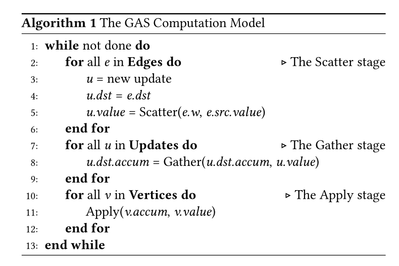

[](./LICENSE)
[](https://github.com/Xtra-Computing/On-the-fly-data-shuffling-for-OpenCL-based-FPGAs/issues)

# ThunderGP: An Efficient Graph Processing Framework for HLS-based FPGAs

## Introduction

ThunderGP enables data scientists to enjoy the ***performance*** of FPGA-based graph processing without compromising ***programmability***.

Two aspacts make the ThunderGP deliver superior performance.
On the one hand, ThunderGP embraces an improved execution flow to better exploit the pipeline parallelism of FPGA and alleviate the data access amount to the global memory. On the other hand, the memory accesses are highly optimized to fully utilize the memory bandwidth capacity of the hardware platforms. 

ThunderGP can run on both Xilinx and Intel platforms:

* [Check the implementation on Intel platform out.](https://github.com/Xtra-Computing/On-the-fly-data-shuffling-for-OpenCL-based-FPGAs/)

* On Xilinx multi-SLR based FPGAs, it is running at 250Mhz, and the performance can be up to ***5300 MTEPS (million traversed edges per second)***, or a ***2 times speedup*** over the state-of-the-art.


## Prerequisites
* The gcc-4.8 or above
* Tools:
    * SDAccel 2018.3 Design Suit
    * SDAccel 2019.2 Design Suit
* Evaluated platforms from Xilinx:
    * Xilinx Virtex UltraScale+ FPGA VCU1525 Acceleration Development Kit (SDAccel 2018.3)
    * Alveo U200 Data Center Accelerator Card (SDAccel 2019.2)
    * Alveo U250 Data Center Accelerator Card (SDAccel 2019.2)
    
## Run the code
Currently, ThunderGP supports four build-in graph analytic algorithms, namely PR, SpMV, BFS and SSSP.  
The wanted application can be implemented by passing argument ```app=[the wanted algorithm]``` to ``` make ``` command.   
The below table is for quick reference of this argument.

| Argument    | Accelerated algorithm  |
|--------------|--------------|
| ```app=pr``` | PageRank (PR)|
| ```app=spmv``` | Sparse Matrix-vector Multiplication (SpMV) |
| ```app=bfs``` | Breadth First Search (BFS)|
| ```app=sssp``` | Single Source Shortest Path (SSSP)|

Here is an example of implementing PR algorithm. 
```sh
$ cd ./
$ make cleanall
$ make app=pr all -j # make the host execution program and FPGA execution program for pagerank application. It takes time.
$ ./host [bitfile] [graph name] #e.g., ./host_graph_fpga _x/link/int/graph_fpga.hw.xilinx_vcu1525_xdma_201830_1.xclbin wiki-talk
```
#### More details: [Compiling ThunderGP ](docs/compile_arch.md)

## Results (performance)

Throughput (MTEPS) of different graph processing algorithms over datasets on VCU1525 platform.

| Algo. 	| rmat-21-32 | rmat-24-16  | web-google | wiki-talk| pokec | live-journal| twitter-2010|
|-------	|-------	|-------	|-------	|-------	|-------	|-------	|-------	|
| PR     | 4,274  | 3,797  | 2,502  | 3,138  | 3,790  | 2,860  | 2,438  |
| SpMV   | 4,759  | 4,396  | 2,018  | 3,043  | 3,871  | 3,133  | 2,561  |
| BFS    | 5,395  | 4,619  | 2,431  | 3,775  | 4,072  | 3,490  | 3,004  |
| SSSP   | 3,895  | 3,446  | 1,817  | 2,954  | 3,090  | 2,700  | 2,273  |


Throughput (MTEPS) of different graph processing algorithms over datasets on U200 platform. 

| Algo. 	| rmat-21-32 | rmat-24-16  | web-google | wiki-talk| pokec | live-journal| twitter-2010|
|-------	|-------	|-------	|-------	|-------	|-------	|-------	|-------	|
| PR     | 4,151 | 3,689 | 3,019 |2,352 |3,670 | 2,734 | 2,319 |
| SpMV   | 4,548 | 4,159 | 2,826 |1,820 |3,650 | 2,931 | 2,375 |
| BFS    | 3,630 | 3,218 | 2,706 |1,620 |2,837 | 2,476 | 2,054 |
| SSSP   | 5,226 | 4,437 | 3,614 |2,247 |3,883 | 3,336 | 2,849 |


Throughput (MTEPS) of different graph processing algorithms over datasets on U250 platform. (TBD)

## APIs (programmability) 
Benefiting from the high level abstraction of HLS, our APIs natively support C/C++ languages.  
ThunderGraph covers three levels of API for implementation or further exploration. 
APIs in L1 and L2 are for building the accelerators, and APIs of L3 are for host program. Details are as below:

* L1 is used to construct the basic modules to build the compute kernels and the dataflow. 

* L2 provides hooks for mapping graph processing algorithms. 
   * [Mapping new graph analytic algorithms](docs/algorithm_mapping.md)  

* L3 provides the high-level APIs on host side to deploy or control graph processing accelerator. Since recent FPGAs usually consist of multiple (SLRs), L3 also wraps the partition scheduling and memory management interface for multiple SLRs. 

   * [Memory Management](docs/memory.md) 

   * [Scheduling](docs/scheduling.md) 

   * [Verification](docs/verification.md)

* More details: [ThunderGP APIs ](docs/api_details.md)


## Framework Overview

### Adopted Computation Model
The Gather-Apply-Scatter (GAS) model is widely used for FPGA-based graph processing frameworks as computation model due to its extensibility to various graph processing algorithms. ThunderGP adopts a simplified version of GAS model by following work [*On-the-fly-data-shuffling-for-OpenCL-based-FPGAs*](https://www.comp.nus.edu.sg/~hebs/pub/fpl19-graph.pdf)
This model updates the vertex property by propagating from source vertex to destination vertex. The input for the model is an unordered set of directed edges of the graph. Undirected edges in a graph can be represented by a pair of directed edges. 



The process per iteration mainly contains three stages: **Scatter**, **Gather**, and **Apply**. 

* In the  **Scatter** stage (shown in line 2 to 6), for each input edge with format ```<src, dst, weight>```, an update tuple is generated for the destination vertex of the edge. The update tuple is of the format ```<dst, value>```, where the *dst* is the destination vertex of the edge and *value* is generated by processing the vertex properties and edge weights. 
* In the **Gather** stage (shown in line 7 to 9), all the update tuples generated in the  **Scatter** stage are accumulated to update destination vertices. 
* The final **Apply** stage (shown in line 10 to 12) executes an apply function on all the vertices of the graph. 


### Execution Flow of ThunderGP


As shown in the above diagram, The edges in one partition are streamed into **Scatter** stage, For each edges, the property of source vertices will be fetched from the global memory by the per-fetching and the cache module, at the same time, the property of corresponding edge, or the weight of edge is loaded from global memory in stream, then these two value go through an *__algorithm-specific processing__* which return an update of the property of the destination vertex, finally, at the end of scatter stage, this update value and the destination of this edge is combined to create a update tuple. The update tuples are streamed into the shuffle stage which dispatches the tuples to corresponding gather processing engines(PEs). The **Gather** PEs *__accumulates__* the update value in local on-chip memory which is caching the property of destination vertices. After all the edges in this partition are processed, the cached data in gather PEs will be aggregated to the global memory. and the **Apply** stage which calls *__algorithm-specific function__* updates all the vertices for the next iteration.


## Related publications
* Xinyu Chen*, Ronak Bajaj^, Yao Chen, Jiong He, Bingsheng He, Weng-Fai Wong and Deming Chen. [On-The-Fly Parallel Data Shuffling for Graph Processing on OpenCL-based FPGAs](https://www.comp.nus.edu.sg/~hebs/pub/fpl19-graph.pdf). FPL, 2019.
* Xinyu Chen*, Yao Chen^, Ronak Bajaj, Jiong He, Bingsheng He, Weng-Fai Wong and Deming Chen. [Is FPGA useful for hash joins](https://www.comp.nus.edu.sg/~hebs/pub/cidr20-join.pdf). CIDR 2020: Conference on Innovative Data Systems Research


## Related systems
* Graph systems on GPU: [G3](https://github.com/Xtra-Computing/G3) | [Medusa](https://github.com/Xtra-Computing/Medusa)
* Other Thunder-series systems in Xtra NUS: [ThunderGBM](https://github.com/Xtra-Computing/thundergbm) | [ThunderSVM](https://github.com/Xtra-Computing/thundersvm)
