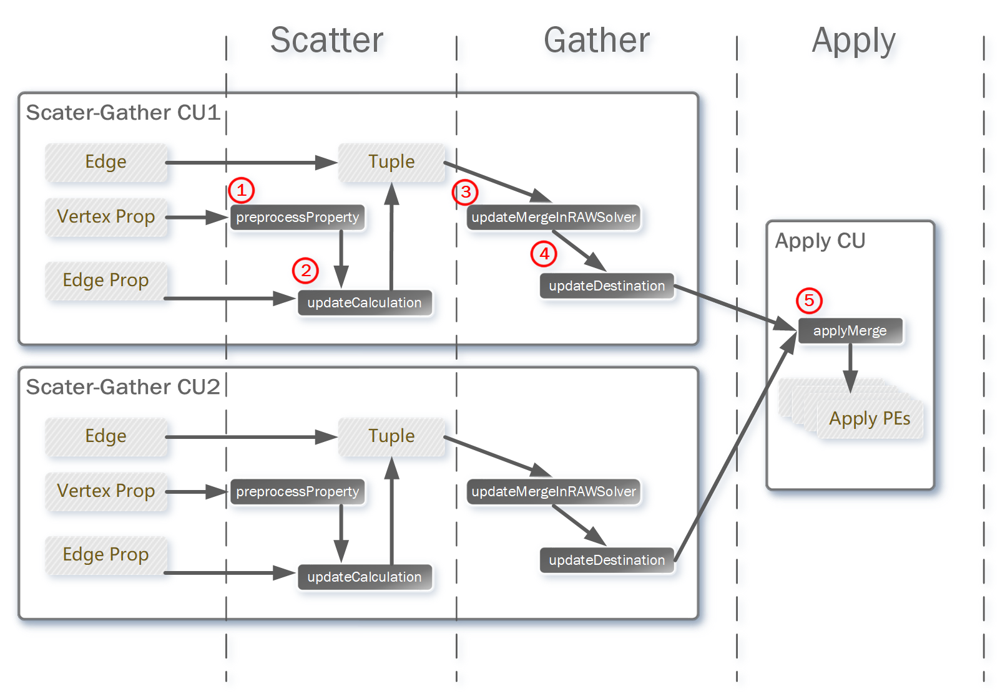

# Algorithm Mapping
In this section, we introduce how to map new algorithms to our framework with __L2__ level APIs provided by ThunderGP.

Based on the execution flow of ThunderGP, there are two types of compute kernel: the scatter-gather and the apply. Mapping new graph analytic algorithms is equivalent to reconstruct or reconfigure these two compute kernels and it is easy to achieve by using the __L2__ interface provided by ThunderGP. Actually, the __L2__ functions act as hooks, meaning that ThunderGP will call them for processing specific event in the data-flow. 

The below figure shows the mapping hooks with unique IDs. In the next, we shall enumerate the coding of hooks with an SpMV example. 




## Sparse Matrix-vector Multiplication (SpMV) as an Example


This figure illustrates a SpMV algorithm. The matrix **A** in CSR format can be mapped into the edges and the property of edges, and the vector **x** is the property of vertices. The compuation of SpMV is shown below:

```c
for (r = 0; r < A.rows; r++)
{
    for (i = A.rowStart[r]; i < A.rowStart[r + 1]; i++)
    {
        y[r] += A.val[i] * x[A.col[i]];
    }
}
```


## Compute Kernel - Scatter-Gather

In our implementation, the gather and scatter stages are combined together by the internal shuffle data path(the shuffle stage), and the implementation of this compute kernel are highly hardware-specific, which is not friendly with the algorithm developers, and it is hiden by following hooks:


##### Hook Functions

| Hooks    | ID | Description  |
|-----------|--|--------------|
| preprocessProperty | 1 | Per-process the source vertex property. |
| updateCalculation | 2 | Calculate the update value by using the edge property and source vertex property.  |
| updateMergeInRAWSolver| 3 | Destination property update in RAW solver. | 
| updateDestination | 4 | Destination property update. | 

Notes: 
* The operation in ```updateDestination``` and ```updateMergeInRAWSolver``` can be very similar, the __difference__ is that  for ```updateDestination```, the data in on-chip memory is not initialized,  which means the accumulations are start from zero, but for ```updateMergeInRAWSolver```,  as the read-after-write hazard only happened in two very closed update tuples, we add a temporary buffer in RAWSolver to sift out the closed update and perform the update in the temporary buffer. Therefore if the update happened, the data in the temporary buffer is initialized. It should be considered when mapping an algorithm with bit-masked property(e.g. BFS).
* If the accelerator configuration ```HAVE_EDGE_PROP``` is set to false the hook ```updateCalculation``` will not be called because there is no property of edges.

##### Accelerator Configuration

Developers also need to modify the accelerator configuration to fit their algorithm. 

| Configuration | Value | Description  |
|---------------|-------|--------------|
| HAVE_VERTEX_ACTIVE_BIT | true/false  | This is a bit-masked mechanism which control the tuple is going to update the property of corresponding vertex or not, it is used in BFS-like algorithms (e.g BFS, SSSP) which need to mark the active vertices. |
| HAVE_EDGE_PROP |         true/false  | For some algorithms (e.g. SpMV, SSSP) they need the property of edges to make the calculation with the property of vertices, by setting this parameter, ThunderGP will automatically add a data path for load and process the property of edges. |
| HAVE_UNSIGNED_PROP    |  true/false  | If you need a signed property, set it to false.  |

by using __L2__ interface, mapping the scatter-gather stage of a new algorithm is very simple, it can also get a pretty good performance without touching the low-level code.

### Example

In SpMV, these hooks in Scatter-Gather can be easily instanced as follows:

```c
/* directly pass the value, do not need in SpMV */
inline prop_t preprocessProperty(prop_t srcProp)
{
    return (srcProp);
}

/*  calculate the  A.val[i] * x[A.col[i]]; */
inline prop_t updateCalculation(prop_t srcProp, prop_t edgeProp)
{
    return ((srcProp) * (edgeProp));
}

/* accumulate y[r] in rawSolver */
inline prop_t updateMergeInRAWSolver(prop_t ori, prop_t update)
{
    return ((ori) + (update));
}

/* accumulate y[r] in on-chip memory */
inline prop_t updateDestination(prop_t ori, prop_t update)
{
    return ((ori) + (update));
}

```

## Compute Kernel - Apply

The apply stage of each graph analytic algorithm may need different types of data, and this variance makes the abstraction a little tough. Currently, ThunderGP provide __two__ methods to adopt apply stage into FPGA accelerator: 

### Using Existing L2 APIs

The first one for mapping apply stage of the graph algorithm is using the __L2__ hooks, but the date type is limited by existing data path. Currently, ThunderGP support load __four__ types of data for the application-specific calculation in apply stage:  

*  The property of vertices;
*  The out-degree of vertices;
*  The update value from scatter-gather stage;
*  An additional big word;

Following table shows the hook functions for apply stage. 

##### Hook Functions

| Hooks    | ID | Description  |
|-----------|--|--------------|
| applyMerge | 5 | Destination property merge from all of the scatter-gather CUs. | 
| applyCalculation | 6 | Calculate the new property of vertices. | 

*  ```applyMerge``` only used in multiple-SLRs.

##### Accelerator Configuration

| Configuration | Value | Description  |
|---------------|-------|--------------|
| HAVE_APPLY | true/false  |  This parameter decides whether the apply compute kernel is needed or not, because that some algorithms may not need apply stage (e.g. SpMV).    |
| CUSTOMIZE_APPLY |         true/false  | If existing abstraction on apply stage can not fit your requirements, you should set it to true and build your specific data-flow using __L1__ function. The details is available in the next section.   |
| HAVE_APPLY_OUTDEG    |  true/false  | This parameter controls whether there is an additional data path for load out-degree. |


### Customization

The second one: ThunderGP also provides a mechanism to using the low level APIs (__L1__) to build customize data-flow. Our existing code in template can be a reference. The customize steps are shown below:

* Modify the apply_kernel.mk, change the variable ```CUSTOMIZE_APPLY``` to true
* Write the accelerator code in vertex_apply.cpp, a HLS function ```vertexApply``` is needed for building the accelerator
* Write the host code and verification code in host_vertex_apply.cpp  host function ```setApplyKernel``` is needed for setting up the arguments of OpenCL kernel, and host function ```partitionApplyCModel``` is needed for the verification of the results from FPGA accelerator.  

We are planning to to provide a script that will automatic generate the interfaces code for customizing the apply stage in the future.

### Example

In SpMV, these hooks in Scatter-Gather can be easily instanced as follows:

```c
/* accumulate y[r] among CUs */
inline prop_t applyMerge(prop_t ori, prop_t update)
{
    return ((ori) + (update));
}
/* no other calculation in apply phase */
inline prop_t applyCalculation( prop_t tProp,
                                prop_t source,
                                prop_t outDeg,
                                unsigned int &extra,
                                unsigned int arg
                              )
{
    return tProp;
}

```
