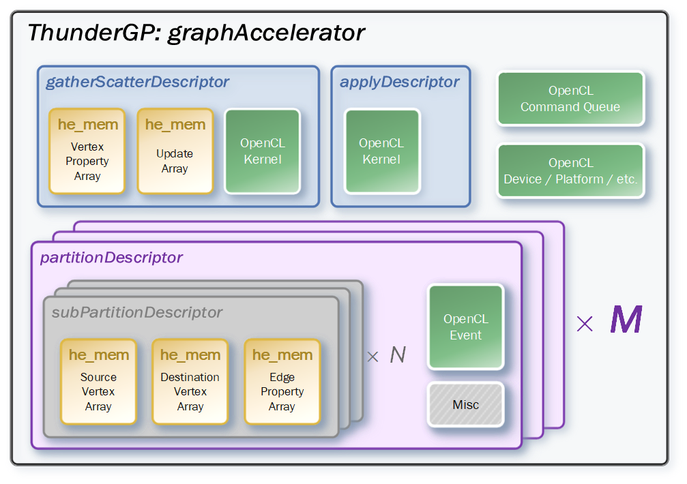
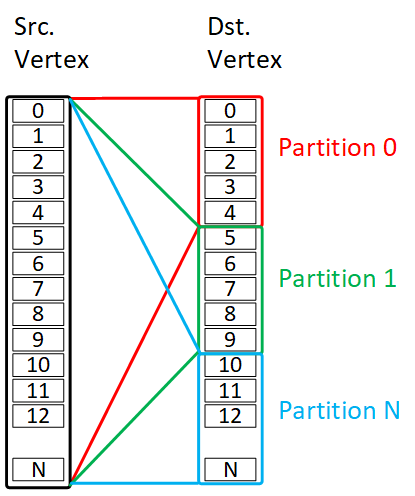
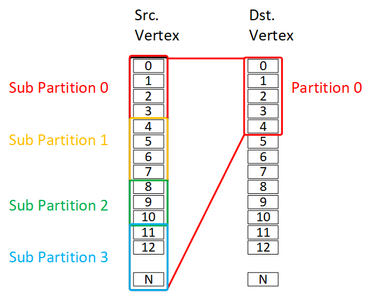

# Memory Management
In this section, we demonstrate how to manage the memory in host side with __L3__ level APIs provided by ThunderGP.


Currently, Xilinx Multiple-SLRs FPGAs have many independent DRAM banks, and many graph algorithms manipulate at least five types of data. Managing the data and the partitions among the banks using the traditional OpenCL APIs need a lot of redundant code for configuration, which makes the code hard to maintaining. Therefore we developed an unique ID based memory management module(**he_mem**), and basing on this module, a hierarchy of data structures is constructed:




All the compuations and operations are heirarchically based on these object, which makes it easy to understand the relationship among the objects. There are two classes of objects in ThunderGP, we call them kernel descriptor and partition descriptor.

## Partition Descriptor
Partition descriptor maintains all the partitioned data among the available DRAM banks, As illustrated in the above figure:


* __partitionDescriptor__: the **purple** blocks are ```partitionDescriptor``` . There are *M* ```partitionDescriptor``` during the processing, where the *M* is determined by the size of graph dataset dynamically. Following figure shows how does ThunderGP perform the partitioning on the graph, each partitions hold edges in a fixed range of destination.




* __subPartitionDescriptor__: ```partitionDescriptor``` consist of *N*  ```subPartitionDescriptor``` (the **grey** blocks), the *N* is determined by how many CUs are available in the FPGA side. The ```subPartitionDescriptor``` structure consists of three types of partitioned data of edge: the destination of edges, the source of edges and the property of edges. Each type of data is contained in ```he_mem``` elements (the **yellow** blocks).  Following figure shows how does ThunderGP perform the sub-partitioning on the partitions, the edges of each partition is equally divided into *N* parts, here the *N* is 4.




## Kernel Descriptor

There are two types of kernel descriptor: the ```gatherScatterDescriptor``` and ```applyDescriptor```. Showing in the heirarchy figure, the **blue** blocks are the kernel descriptor, both of these two types of descriptors have an instance of OpenCL kernel (the **green** blocks). The property of vertices are also included in ```gatherScatterDescriptor```.


## Appendix

API list for ```he_mem``` 

| Function    | Description  |
|-------------|--------------|
| ``` int he_mem_init() ```| initialize the ```he_mem``` structure |
| ``` cl_mem* get_cl_mem_pointer() ```| get the OpenCL ```cl_mem``` instance in the specific ```he_mem```  |
| ``` void* get_host_mem_pointer() ```| get the host memory pointer in the specific ```he_mem```|
| ``` he_mem_t* get_he_mem() ```| get the instance of ```he_mem``` by the unique ID|
| ``` int transfer_data_from_pl() ```| transfer the data from FPGA to CPU |
| ``` int transfer_data_to_pl() ```| transfer the data from CPU to FPGA |
