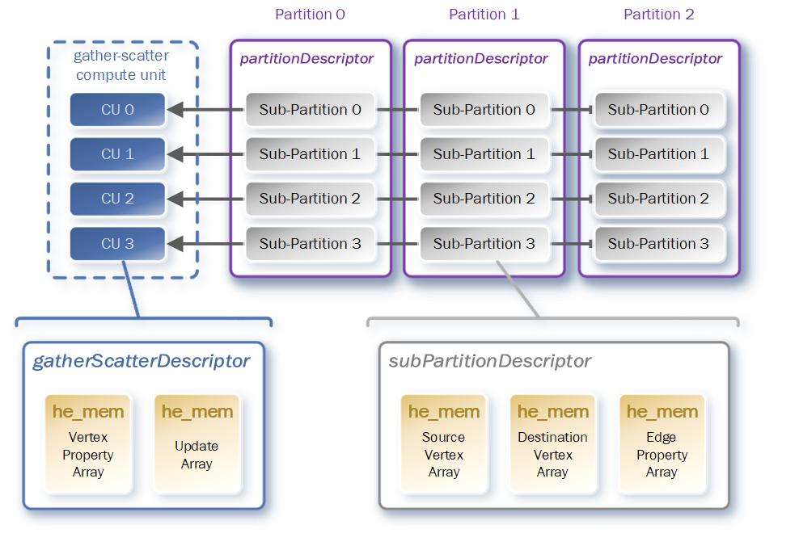
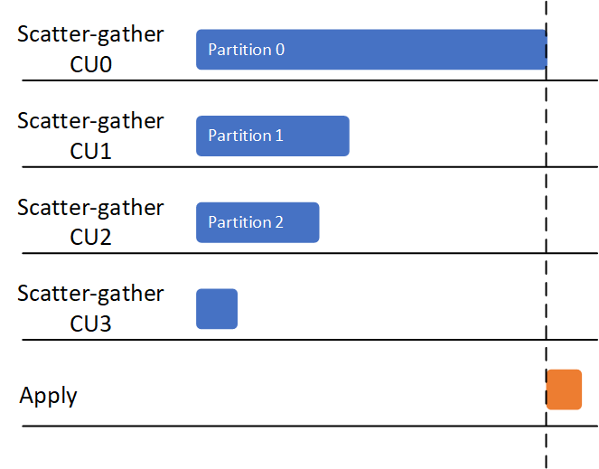
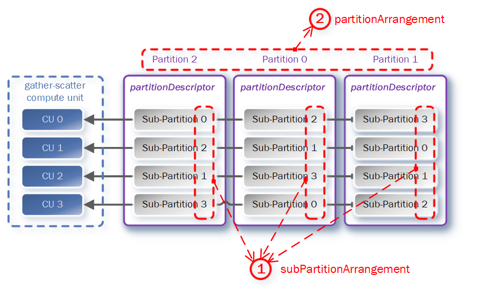

# Scheduling across Multi-SLRs

While modern multi-SLRs based FPGAs provide high memory bandwidth and large hardware resources, utilizing it is not straightforward since the higher bandwidth comes from multiple independent memory channels, and it can make obtaining an efficient mapping of the kernels with high data transmission between the SLRs difficult.

This poses two challenges of deploying efficient graph processing framework to modern FPGAs with multiple SLRs:

* allocating multiple kernels into multiple SLRs to fully utilize the FPGA resources; 
* scheduling graph partitions through multiple memory channels to fully utilize the memory bandwidth;


For the first problem, you can find more details in our paper(under review), and in this section we will focus on the second problem (__scheduling__).


## Unbalanced Workloads


This figure shows a processing routine with __naive__ scheduling, the sub-partitions are arranged in sequence (the 1st sub-partitions goes to 1st CU), and the partitions are processed in order. From our observation, this naive arrangement have significantly bad influence on the performance because the __unbalanced__ partitions, following figure shows an __unbalanced__ case.




## Scheduling in ThunderGP

To solve this unbalancing problem, ThunderGP schedules the sub-partitions in the following step:

* Calculate the estimated execution time of scheduled sub-partitions in each CUs.
* Calculate the estimated execution time of  sub-partitions of the coming partition.
* The determination of the sub-partition order can convert to an optimization problem which the goal is to minimize the difference of the total estimated execution time of each CUs in the given order.

in here ThunderGP also build a performance estimator:

* Assuming the execution time is a function like that:
    * ***T = f(V, E)***
    * ***T***: execution time of one sub-partition
    * ***V***: the number of vertices in this sub-partition
    * ***E***: the number of edges in this sub-partition

* Sample some sub-partitions from the dataset, and get the real execution time in single compute unit.
* Polynomial model is choosed to  represent this model,  we start fit the model parameters from high order polynomial, and iterativly decrease the order to find the best fitting and estimation.

The result shows that this scheduling scheme have significant improvement on real graph dataset, comparing with the unbalanced order.  For Twitter-SoC dataset it have near **55%** throughput improvement and **21%** for Livejournal1.


## Customization

As the scheduling problem is well studied in system communities and there is a huge solution space, ThunderGP also provides interface for users to customize the scheduling method for further exploration. To write a new scheduler:



* Firstly, user need to create a folder in the ```libgraph/scheduler```. The name of the folder is also the name of this customized scheduler (e.g. *__normal__*).

* Secondly, in this folder, ```scheduler.cpp``` is needed to write the customized code. The two types of arrangement(shown in the above diagram) need to be instanced in a scheduler.

    * **```subPartitionArrangement```**: ① in the figure, orchestrates the sub-partitions in a specific order.

    * **```partitionArrangement```**: ② in the figure, orchestrates the partitions in a user-defined order.


* When this two orchestrations are finished, it need to be integrated into ThunderGP. Taking the existing scheduler named *__normal__* as an example: ( ```libgraph/scheduler/normal/scheduler.cpp```)  
```c
static graphStaticScheduler dut = {
    .init                   = normalInitHanlder,
    .subPartionScheduler    = normalSubPartitionArrangementHandler, //subPartitionArrangement
    .partitionScheduler     = normalSchedulerPartitionArrangement, //partitionArrangement
};

int schedulerRegister(void)
{
    return registerScheduler(&dut);
}


```

    A ```graphStaticScheduler```  object need to be constructed, and then user needs to provide an entry for ThunderGP to execute, the **```schedulerRegister```**, in this function ```registerScheduler``` need to be called for register the ```dut``` which is the ```graphStaticScheduler``` object constructed earlier.

* Finally, to run the application with this customized scheduler, the ```SCHEDULER``` variable in the  ```build.mk``` which is located at the application-specific path need to be modified as the name of the folder which is described in the first step.

```shell
HAVE_FULL_SLR=true

#scatter-gather kernel
HAVE_VERTEX_ACTIVE_BIT=true
HAVE_EDGE_PROP=false
HAVE_UNSIGNED_PROP=true

#apply kernel
HAVE_APPLY=true
CUSTOMIZE_APPLY=false
HAVE_APPLY_OUTDEG=false

#scheduler
SCHEDULER=normal  # We modified this parameter from secondOrderEstimator to normal

```
